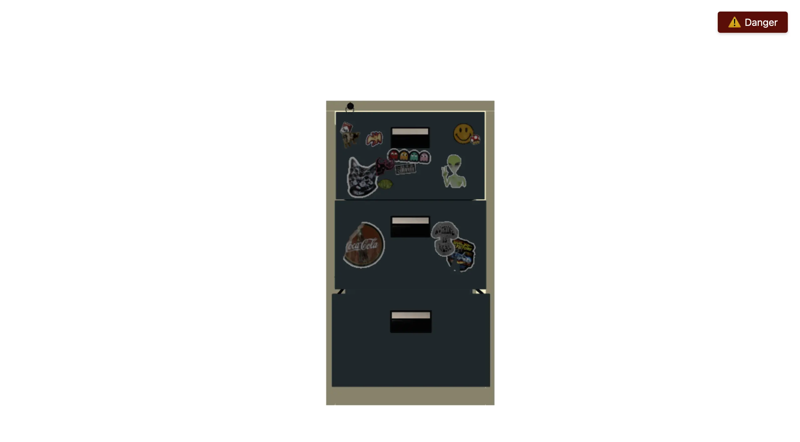
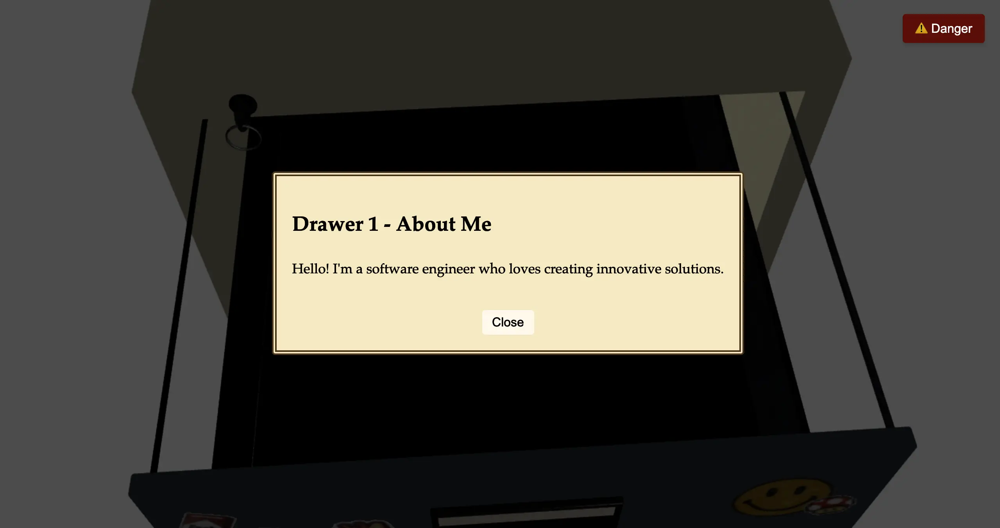

# 📁 Filing Cabinet — Three.js

An interactive 3D filing cabinet built with **Three.js**, featuring animated drawers, documents, and a deliberately chaotic **Danger Mode**.

**[🌐 Live Demo](https://bgd-navy.vercel.app)**

---

## ✨ Preview

<p align="center">
  
</p>

<p align="center">
  
</p>

---

## 🎮 What You Can Do

- **Open drawers** with animated documents inside.
- **Trigger Danger Mode** to make the cabinet swirl, move, and shake.
- **Return to Safety** to restore the cabinet to its original position and orientation.
- **Randomized rotations** between **220° and 360°** make each danger animation slightly different.

This project is an experiment in combining **3D models, animation, interaction, and scene control** on the web.

---

## 🚀 Run Locally

### Prerequisites

- [Node.js](https://nodejs.org/) **18+**
- **pnpm** recommended, or npm

### 1. Clone the repository

```bash
git clone <repo-url>
cd bgd
```

### 2. Install dependencies

```bash
pnpm install
# or
npm install
```

### 3. Start the development server

```bash
npx vite
# or, if configured in package.json:
pnpm run dev
```

Vite will normally serve the app at:

```text
http://localhost:5173
```

Open the URL in your browser and interact with the cabinet.

---

## 🗂️ Project Structure

```text
.
├── index.html                  # App entry point and UI controls
├── index.css                   # Overlay, buttons, and interface styling
├── main.js                     # Three.js scene, interactions, and animations
├── public/
│   └── filing_cabinet/
│       ├── scene.gltf          # 3D cabinet model
│       └── textures/           # Model textures
├── assets/
│   ├── cabinet.webp            # README preview
│   └── opendrawer.webp         # README preview
├── package.json
└── pnpm-lock.yaml
```

---

## 🛠️ Customize the Animation

Most interactive behavior lives in `main.js`.

### Cabinet model

Replace:

```text
public/filing_cabinet/scene.gltf
```

with your own GLTF model and update the referenced textures if needed.

### Danger animation

Experiment with:

- `dangerDuration` — how long the animation runs.
- Sinusoidal **X/Y movement** — the cabinet's floating and swerving motion.
- Rotation logic — how the cabinet spins and shakes.
- `minDeg` / `maxDeg` in `startDanger()` — the randomized spin range.

---

## 📦 3D Model Attribution

**“Filing Cabinet”** by **DavideFon**  
[Sketchfab](https://skfb.ly/oUQzY)

Licensed under [Creative Commons Attribution 4.0](http://creativecommons.org/licenses/by/4.0/).

---

## 🤖 Built With AI Assistance

Used **Backboard CLI** as a coding agent for building most of the animations.

